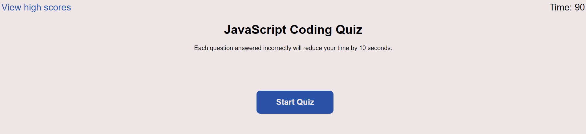
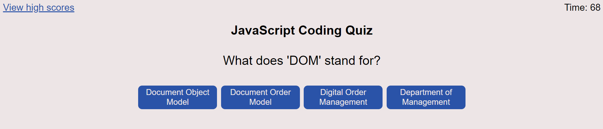

# <JavaScript-Coding-Quiz>

## Description

I created a JavaScript coding quiz in order to test my knowledge on JavaScript.
During this project, I have learned how to create a webpage which can store quiz scores and display them back to the user.

## Usage

Provide instructions and examples for use. Include screenshots as needed.

To add a screenshot, create an `assets/images` folder in your repository and upload your screenshot to it. Then, using the relative file path, add it to your README using the following syntax:

## Features

When the quiz is completed, the user is prompted to input initials to be stored and displayed on a high scores page.
